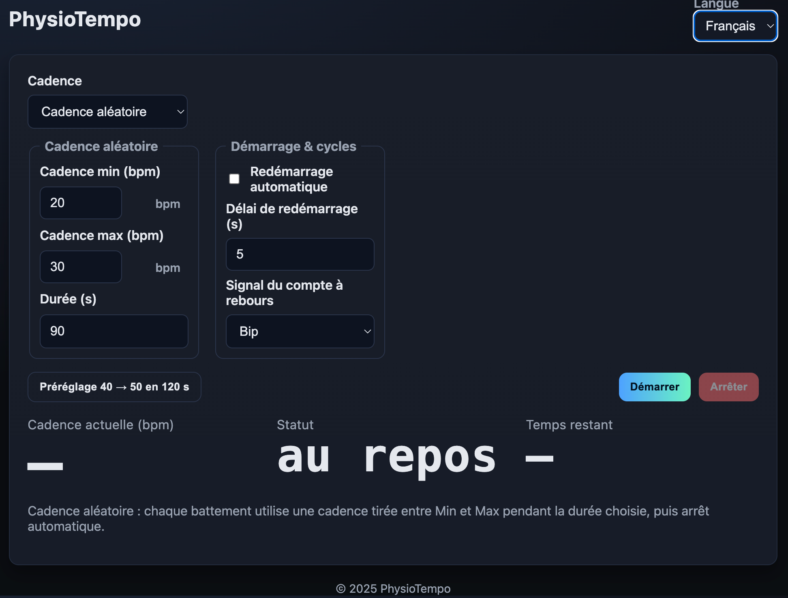
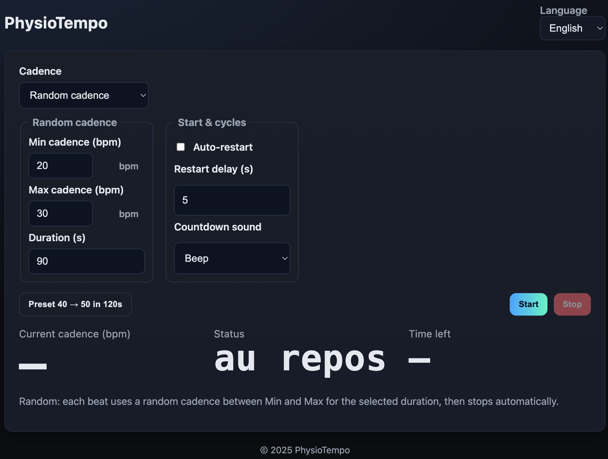

# PhysioTempo

**Lien direct / Live app** → https://sebrbo.github.io/PhysioTempo/

---
## Capture d’écran

## 🇫🇷 FR — À propos

**PhysioTempo** est un outil de cadence pour la rééducation, simple et bilingue (FR/EN). Il propose **trois modes** :
- **Cadence progressive** : accélération linéaire sur une durée (ex. **40 -> 50 bpm en 120 s**), puis arrêt.
- **Cadence fixe (durée)** : cadence constante pendant *N* secondes, puis arrêt.
- **Cadence aléatoire** : chaque bip utilise une cadence aléatoire comprise entre deux valeurs, pendant *N* secondes, puis arrêt.

L’application est une **PWA hors-ligne** et **empêche la mise en veille** pendant la séance.  
**Note iOS** : le mode **"Voix (FR/EN)"** du compte à rebours peut **ne pas fonctionner** sur iPhone/iPad (limitation Safari). Préférez **Bip** sur iOS.

### Utilisation rapide
1. Ouvrir : https://sebrbo.github.io/PhysioTempo/
2. Choisir un **mode** (progressive / fixe / aléatoire).
3. Renseigner les **paramètres** du mode.
4. (Option) Activer **Redémarrage automatique** et régler le **délai**.
5. Choisir le **signal de compte à rebours** (**Muet** / **Bip** / **Voix**).
6. Cliquer **Démarrer** (ou appuyer sur **Espace**) : compte à rebours **4-3-2-1-GO**, puis séance.
7. Cliquer **Arrêter** pour interrompre.
- **Préréglage** : 40 -> 50 bpm en 120 s.
- **Langue** : FR/EN (préférence mémorisée).

### Paramètres par mode
- **Cadence progressive** : *Cadence de départ (bpm)*, *Cadence d’arrivée (bpm)*, *Durée d’accélération (s)*.
- **Cadence fixe (durée)** : *Cadence (bpm)*, *Durée (s)*.
- **Cadence aléatoire** : *Cadence min (bpm)*, *Cadence max (bpm)*, *Durée (s)*.

### Affichages
- **Cadence actuelle (bpm)**, **Statut**, **Temps restant** (compte à rebours ou séance).

### Audio
- Pas de curseur de volume dans l’UI : le niveau est **optimisé** côté app ; utilisez le **volume matériel** de l’appareil.
- Compte à rebours : **Muet / Bip / Voix** (retombe automatiquement sur **Bip** si la voix n’est pas disponible).

### PWA (hors-ligne & installation)
- Après le **premier chargement HTTPS**, l’app fonctionne **hors-ligne**.
- **Installer** :
  - **Desktop** : Chrome/Edge -> « Installer l’application ».
  - **Android** : « Ajouter à l’écran d’accueil ».
  - **iOS/iPadOS (Safari)** : Partager -> « Sur l’écran d’accueil ».

### Conseils & limites
- **Déverrouillage audio** : un **tap** peut être requis au premier lancement (politique d’autoplay).
- **iOS** : vérifier le **mode silencieux** matériel ; le **Wake Lock** évite la veille pendant la séance (si supporté).
- **Précision** : planification audio avec look-ahead ; le rendu dépend du matériel/OS.

### Licence
- **Code** : PolyForm Noncommercial 1.0.0 — **usage commercial interdit** (voir `LICENSE`).  
  SPDX : `PolyForm-Noncommercial-1.0.0`
- **Assets** (icônes, images, textes) : **CC BY-NC 4.0** (voir `LICENSE-CC-BY-NC-4.0.md`).

---
## Screenchot

## 🇬🇧 EN — About

**PhysioTempo** is a simple, bilingual (FR/EN) rehab cadence trainer with **three modes**:
- **Progressive cadence**: linear ramp over a duration (e.g., **40 -> 50 bpm in 120 s**), then stop.
- **Fixed cadence (timed)**: constant cadence for *N* seconds, then stop.
- **Random cadence**: each beat uses a random cadence between two values for *N* seconds, then stop.

It’s an **offline-capable PWA** and **prevents screen sleep** during sessions.  
**iOS note**: the **"Voice (FR/EN)"** countdown may **not work** on iPhone/iPad (Safari limitation). Prefer **Beep** on iOS.

### Quick start
1. Open: https://sebrbo.github.io/PhysioTempo/
2. Select a **mode** (progressive / fixed / random).
3. Set the **mode parameters**.
4. (Optional) Enable **Auto-restart** and set **delay**.
5. Choose **countdown signal** (**Mute** / **Beep** / **Voice**).
6. Click **Start** (or press **Space**) -> **4-3-2-1-GO** countdown, then session.
7. Click **Stop** to end.
- **Preset**: 40 -> 50 bpm in 120 s.
- **Language**: FR/EN (preference saved).

### Mode parameters
- **Progressive**: *Start cadence (bpm)*, *End cadence (bpm)*, *Ramp duration (s)*.
- **Fixed (timed)**: *Cadence (bpm)*, *Duration (s)*.
- **Random**: *Min cadence (bpm)*, *Max cadence (bpm)*, *Duration (s)*.

### Readout
- **Current cadence (bpm)**, **Status**, **Time left** (countdown or session).

### Audio
- No volume slider in the UI: level is **optimized** in-app; use the device’s **hardware volume**.
- Countdown: **Mute / Beep / Voice** (automatic fallback to **Beep** if voice isn’t available).

### PWA (offline & install)
- After the **first HTTPS load**, the app works **offline**.
- **Install**:
  - **Desktop**: Chrome/Edge -> “Install”.
  - **Android**: “Add to Home screen”.
  - **iOS/iPadOS (Safari)**: Share -> “Add to Home Screen”.

### Tips & limits
- **Autoplay**: an initial **tap/click** may be required to unlock audio.
- **iOS**: check the hardware **silent switch**; **Wake Lock** prevents sleep during sessions (where supported).
- **Timing**: look-ahead scheduling; final output depends on device/OS.

### License
- **Code**: PolyForm Noncommercial 1.0.0 — **no commercial use** (see `LICENSE`).  
  SPDX: `PolyForm-Noncommercial-1.0.0`
- **Assets** (icons, images, text): **CC BY-NC 4.0** (see `LICENSE-CC-BY-NC-4.0.md`).

---

**Crédits / Credits** : © 2025 Sebrbo and contributors — Contributions welcome via **Issues** and **Pull Requests**.
