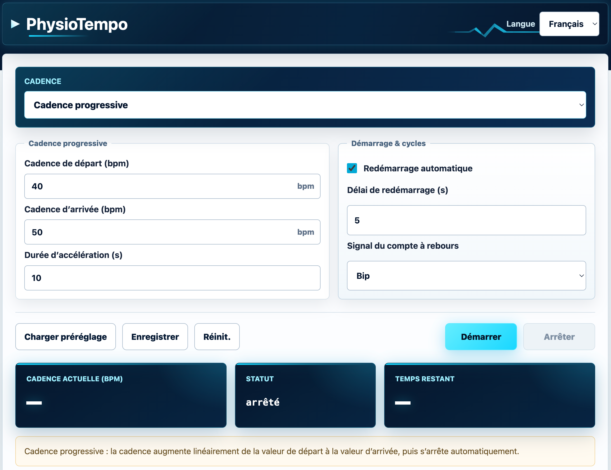
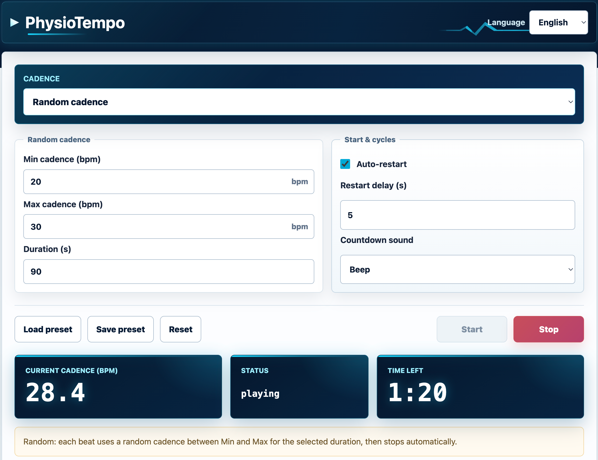

# PhysioTempo

**Lien direct / Live app** -> https://sebrbo.github.io/PhysioTempo/

---

## Capture d'ecran

  

## FR - A propos

**PhysioTempo** est une webapp statique, simple et bilingue (FR/EN), concue pour accompagner des exercices de cadence en kine/reeducation. Elle sert d'aide au rythme pendant une seance et ne fournit pas de diagnostic, de prescription, ni d'avis medical.

L'application propose **cinq modes** :

- **Cadence progressive** (`accel`) : acceleration lineaire sur une duree, par exemple 40 -> 50 bpm en 120 s, puis arret.
- **Cadence fixe (duree)** (`steady`) : cadence constante pendant une duree choisie, puis arret.
- **Cadence aleatoire** (`random`) : chaque bip utilise une cadence aleatoire comprise entre deux valeurs pendant une duree choisie, puis arret.
- **Excentrique (series x reps)** (`ecc`) : repetitions excentriques avec duree d'effort et temps de retour parametrables.
- **HSR (series x reps)** (`hsr`) : repetitions lentes controlees avec phases concentrique/excentrique, pauses optionnelles et repos entre repetitions/series.

PhysioTempo est une **PWA hors-ligne** : apres un premier chargement en HTTPS, le service worker met en cache les fichiers statiques necessaires au fonctionnement offline. L'application tente aussi d'empecher la mise en veille pendant une seance via Wake Lock lorsque le navigateur le supporte.

**Note iOS** : le mode **"Voix (FR/EN)"** du compte a rebours peut ne pas fonctionner sur iPhone/iPad selon les limitations de Safari. Preferer **Bip** sur iOS.

### Utilisation rapide

1. Ouvrir : https://sebrbo.github.io/PhysioTempo/
2. Choisir un **mode**.
3. Renseigner les **parametres** du mode.
4. Optionnel : activer **Redemarrage automatique** et regler le delai.
5. Choisir le **signal du compte a rebours** : **Muet**, **Bip** ou **Voix**.
6. Cliquer **Demarrer** : compte a rebours **4-3-2-1-GO**, puis seance.
7. Cliquer **Arreter** pour interrompre.

Le code actuel ne contient pas de raccourci clavier dedie pour demarrer avec la touche Espace.

### Parametres par mode

- **Cadence progressive** : cadence de depart, cadence d'arrivee, duree d'acceleration.
- **Cadence fixe (duree)** : cadence, duree.
- **Cadence aleatoire** : cadence min, cadence max, duree.
- **Excentrique (series x reps)** : series, repetitions par serie, temps d'effort excentrique, retour a la position de depart.
- **HSR (series x reps)** : series, repetitions par serie, duree concentrique, duree excentrique, pause en haut, pause en bas, repos entre repetitions, repos entre series.

### Affichages

- **Cadence actuelle (bpm)** pour les modes de cadence.
- **Statut** pour l'etat de lecture, les phases et les series/repetitions.
- **Temps restant** pour le compte a rebours, la seance ou les repos.

### Audio

- Le volume est gere cote app ; utiliser le volume materiel de l'appareil.
- Compte a rebours : **Muet**, **Bip** ou **Voix**.
- La voix utilise `speechSynthesis` lorsque disponible et retombe sur un bip si la voix ne peut pas etre lancee.
- La precision depend du navigateur, de l'OS et du materiel ; les bips sont planifies avec un scheduler Web Audio en look-ahead.

### PWA (hors-ligne & installation)

- Le manifeste PWA est declare dans `manifest.webmanifest`.
- Le fonctionnement offline est gere par `service-worker.js`.
- Les fichiers principaux mis en cache incluent `index.html`, le CSS versionne `css/style.css?v=2026-06-30-v25`, le script applicatif versionne `js/app.js?v=2026-06-30-v25`, le manifeste et les icones.
- Installation :
  - **Desktop** : Chrome/Edge -> Installer l'application.
  - **Android** : Ajouter a l'ecran d'accueil.
  - **iOS/iPadOS (Safari)** : Partager -> Sur l'ecran d'accueil.

### Conseils & limites

- Un tap/clic initial peut etre requis pour deverrouiller l'audio selon les politiques d'autoplay du navigateur.
- Sur iOS, verifier le mode silencieux materiel.
- Wake Lock n'est actif que si le navigateur le supporte.
- PhysioTempo est un outil d'aide au rythme pour l'exercice ; il ne remplace pas le jugement clinique.

### Licence

- **Code** : PolyForm Noncommercial 1.0.0 - usage commercial interdit (voir `licence`).
- **Assets** (icones, images, textes) : CC BY-NC 4.0 (voir `LICENSE-CC-BY-NC-4.0`).

---

## Screenshot

  

## EN - About

**PhysioTempo** is a simple bilingual (FR/EN) static webapp designed to support cadence-based physiotherapy and rehabilitation exercises. It is a rhythm aid for sessions and does not provide diagnosis, prescriptions, or medical advice.

The app currently provides **five modes**:

- **Progressive cadence** (`accel`): linear ramp over a duration, for example 40 -> 50 bpm in 120 s, then stop.
- **Fixed cadence (timed)** (`steady`): constant cadence for the selected duration, then stop.
- **Random cadence** (`random`): each beat uses a random cadence between two values for the selected duration, then stop.
- **Eccentric (sets x reps)** (`ecc`): eccentric repetitions with configurable effort and return durations.
- **HSR (sets x reps)** (`hsr`): slow controlled repetitions with concentric/eccentric phases, optional holds, and rest between reps/sets.

PhysioTempo is an **offline-capable PWA**: after the first HTTPS load, the service worker caches the static files required for offline use. The app also tries to prevent screen sleep during sessions via Wake Lock when supported by the browser.

**iOS note**: the **"Voice (EN/FR)"** countdown may not work on iPhone/iPad depending on Safari limitations. Prefer **Beep** on iOS.

### Quick start

1. Open: https://sebrbo.github.io/PhysioTempo/
2. Select a **mode**.
3. Set the **mode parameters**.
4. Optional: enable **Auto-restart** and set the delay.
5. Choose the **countdown signal**: **Mute**, **Beep**, or **Voice**.
6. Click **Start**: **4-3-2-1-GO** countdown, then session.
7. Click **Stop** to interrupt.

The current code does not include a dedicated Space keyboard shortcut for starting the session.

### Mode parameters

- **Progressive cadence**: start cadence, end cadence, ramp duration.
- **Fixed cadence (timed)**: cadence, duration.
- **Random cadence**: min cadence, max cadence, duration.
- **Eccentric (sets x reps)**: sets, reps per set, eccentric effort duration, return-to-start duration.
- **HSR (sets x reps)**: sets, reps per set, concentric duration, eccentric duration, top hold, bottom hold, rest between reps, rest between sets.

### Readout

- **Current cadence (bpm)** for cadence modes.
- **Status** for playback state, phases, sets, and reps.
- **Time left** for countdowns, sessions, or rests.

### Audio

- Volume is managed in-app; use the device hardware volume.
- Countdown: **Mute**, **Beep**, or **Voice**.
- Voice uses `speechSynthesis` when available and falls back to a beep if speech cannot start.
- Timing precision depends on the browser, OS, and hardware; beeps are scheduled with a Web Audio look-ahead scheduler.

### PWA (offline & install)

- The PWA manifest is declared in `manifest.webmanifest`.
- Offline behavior is handled by `service-worker.js`.
- Cached core files include `index.html`, the versioned CSS `css/style.css?v=2026-06-30-v25`, the versioned app script `js/app.js?v=2026-06-30-v25`, the manifest, and icons.
- Install:
  - **Desktop**: Chrome/Edge -> Install app.
  - **Android**: Add to Home screen.
  - **iOS/iPadOS (Safari)**: Share -> Add to Home Screen.

### Tips & limits

- An initial tap/click may be required to unlock audio because of browser autoplay policies.
- On iOS, check the hardware silent switch.
- Wake Lock only works when supported by the browser.
- PhysioTempo is an exercise rhythm aid; it does not replace clinical judgment.

### License

- **Code**: PolyForm Noncommercial 1.0.0 - no commercial use (see `licence`).
- **Assets** (icons, images, text): CC BY-NC 4.0 (see `LICENSE-CC-BY-NC-4.0`).

---

**Credits / Credits**: © 2025 Sebrbo and contributors - Contributions welcome via **Issues** and **Pull Requests**.
